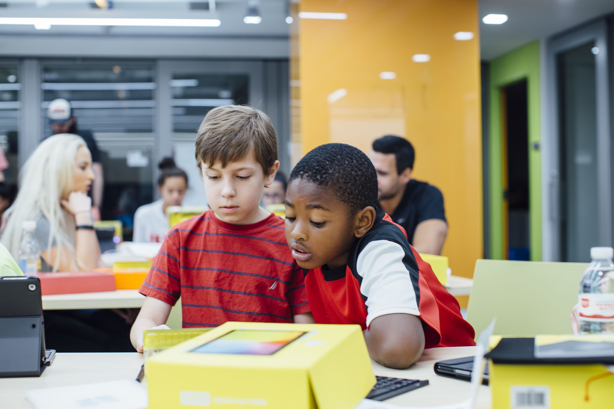
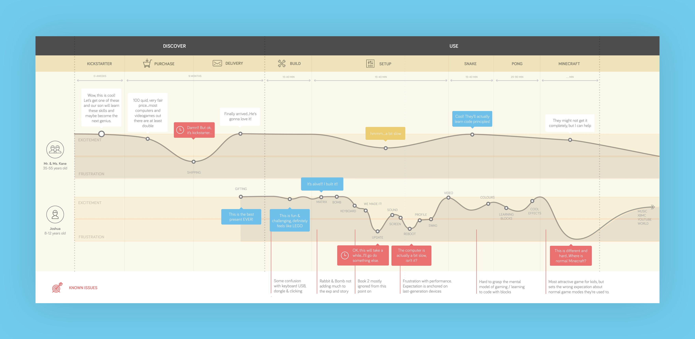
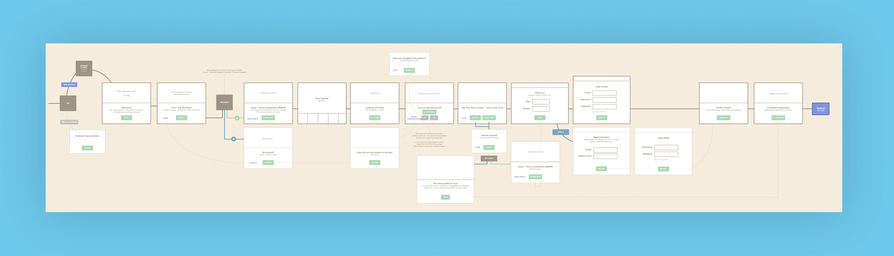
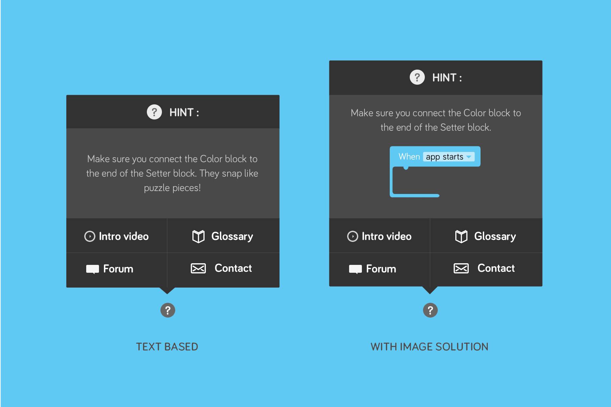
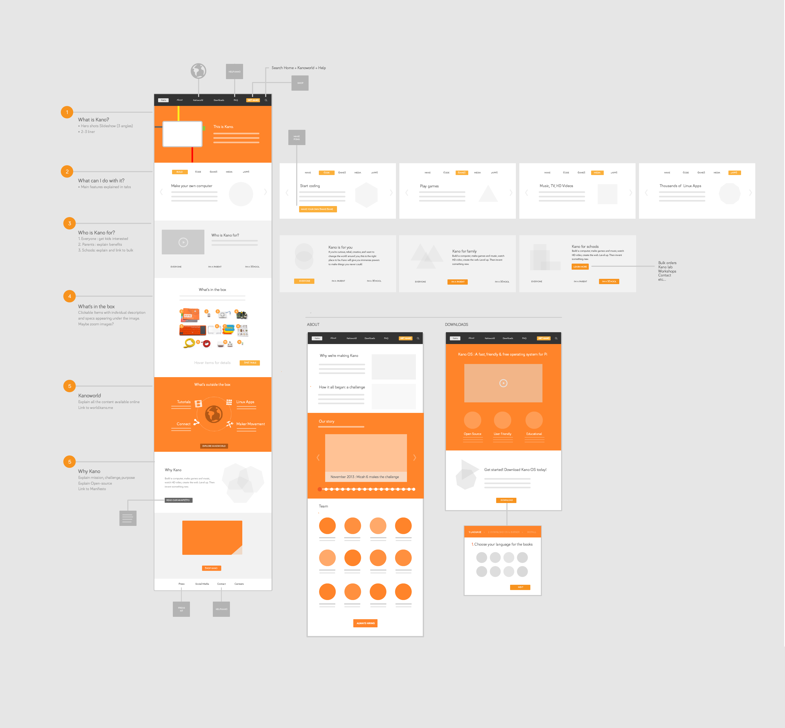
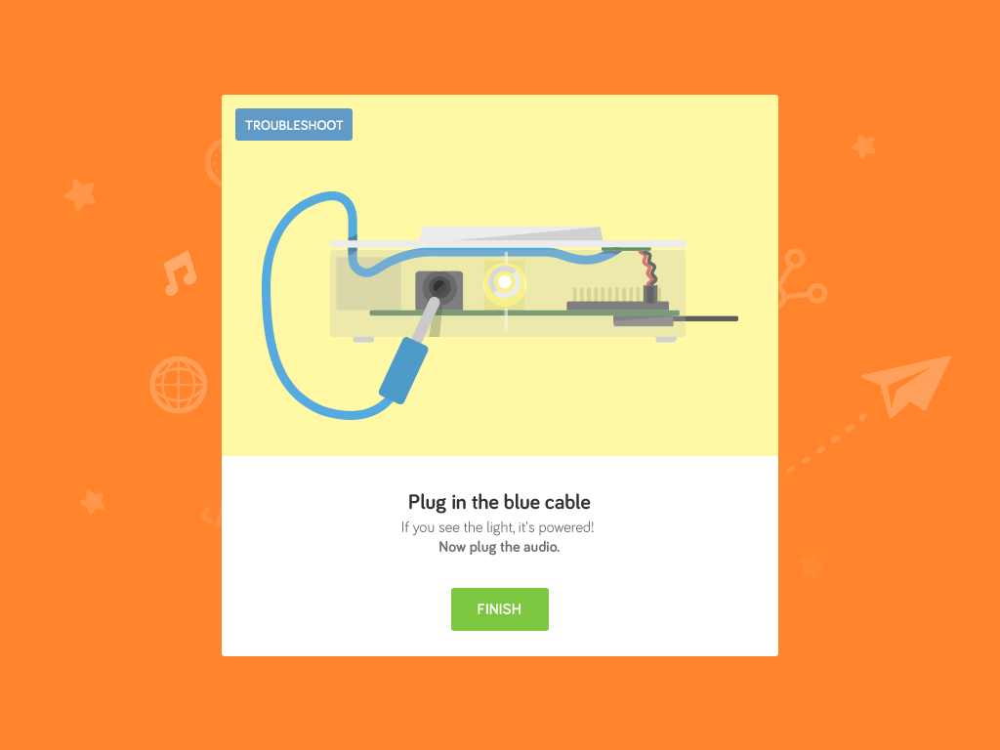
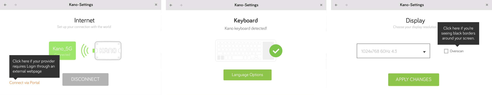

In the summer of 2014, I got my first job with digital products at Kano Computer, a record-breaking Kickstarter.com startup, as their incredible teams sprinted to ship the first version of Kano.

# Assorted deliverables to help the company succeed

A the time I joined, the product was expected to ship in 4 months. Kano is a physical computer, which means it ships with an OS that wouldn't get an update until the user had been successfully onboarded and connected to WiFi on their homes. During my internship, I wore multiple hats to help the team ensure that users would be correctly onboarded — and have fun! — in their first experience with the product. I touched everything from usability testing with kids in school, to copywriting, usability heuristic reviews, and UI design.

## Settings and help

Kano is a product for kids and families. I was assigned to review the settings part of the OS, as well as the help products and knowledge base to make sure that the options, language and copywriting were as friendly and clear as possible.

As part of the launch strategy, we needed to be ready with content-rich, self-service help tools both inside the OS and on the web to deflect as much support contact as possible. As part of the effort to understand the critical pain points and possible questions, we conducted usability tests with kids and families both in the office and on the field.

<figure>
  

    
  

</figure>
  

    
  

<figcaption>The troubleshooting onboarding screens</figcaption>

## Learnings

Working at Kano was an experience that defined the path I'd choose to my career. I fell in love with working with a team that had a clear purpose and were extremely passionate about their product and its impact on people's lives.

As it was at the time a tiny startup with few resources, I had to use and grow my skills to encompass a great variety of jobs that needed to get done — without compromising on quality. Ultimately, Kano was the home where I had space and support to build the structure of the processes and skills I use today in my daily work.
