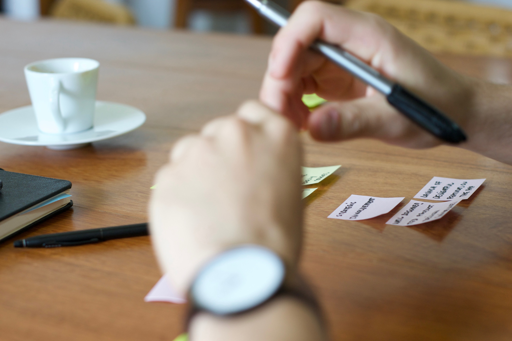
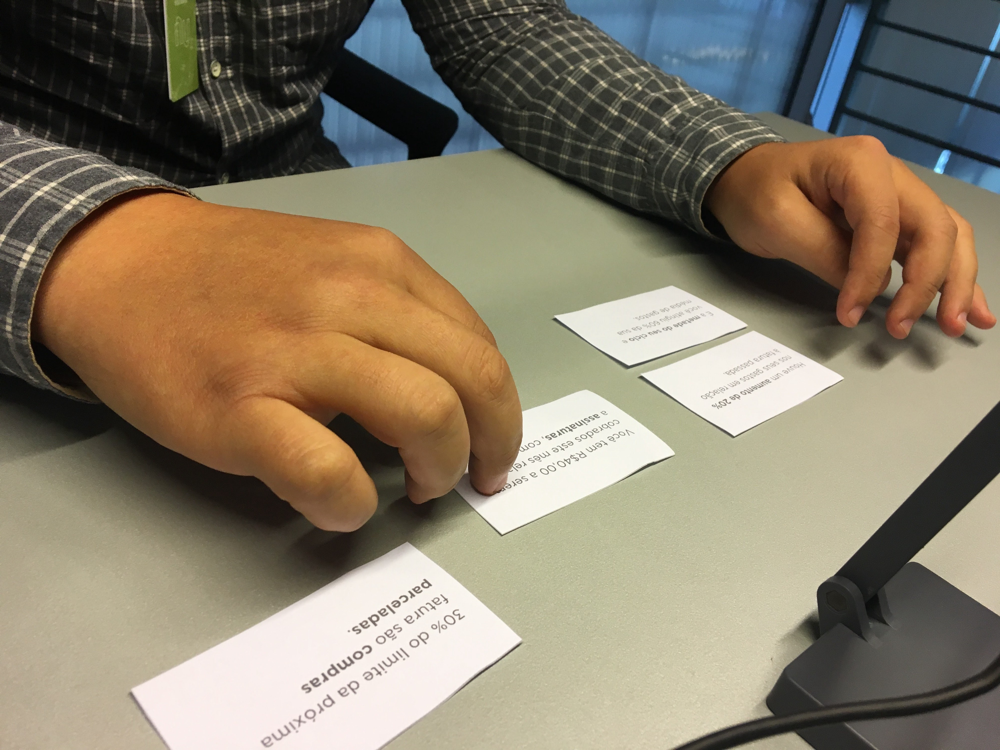
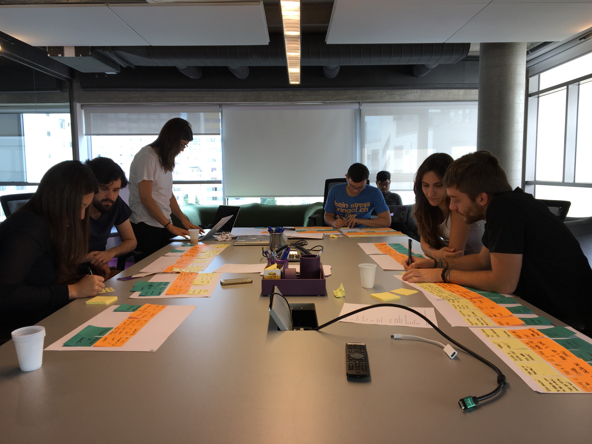
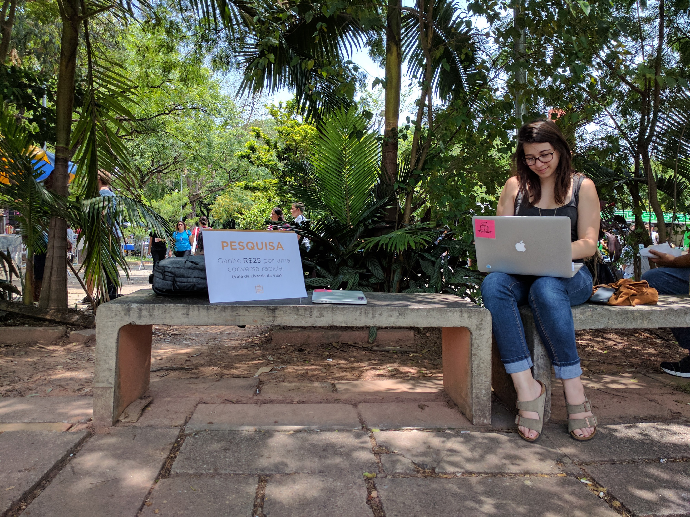
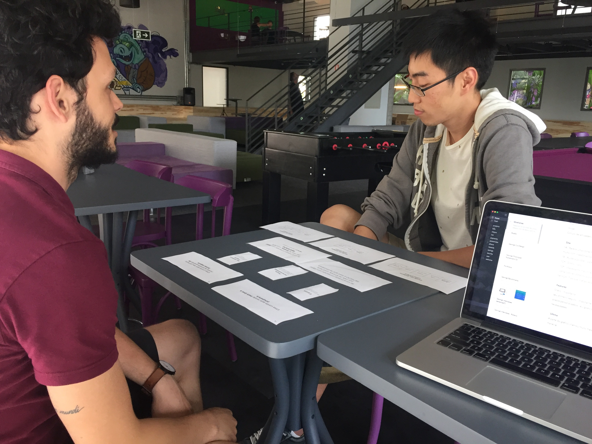
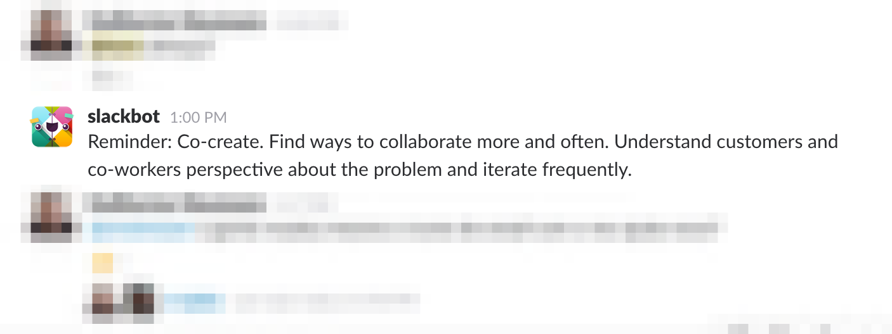

In May 2016, Nubank was in the process of growing from a living-room sized startup to a much larger and complex organization. This growth impacted many teams, and design was no exception.
To help us navigate this fast-paced transformation, our team started exploring ways to better define and monitor what we believe design should be at Nubank, regardless of scale, direction, external opinions or trends. One of these measures was to get together and write down our own set of design principles.

## Inspiration

Design principles are not new. Dieter Rams’ famous 10 principles of good design, formulated during the seventies, was useful not only to his team at Braun, but also as a teaching tool and a personal message to the outside world about what he believed led to better designed products. Needless to say, this list has become such timeless advice that it now hangs in walls of designers building all types of product around the world, both in physical and digital media.

More recently, Facebook’s design team has also published their set of seven principles. The similarities and contrasts between Rams’ and Facebook’s principles the value behind the exercise: the clarity of a simple list allows for both employees and outsiders to empathize with the beliefs and challenges of the designers in each case. For Dieter, the challenge was to ensure his client’s consumer goods followed a certain order, harmony, and economy of production. For Facebook, the list serves as a practical baseline of what a global app with billions of users needs: accessibility, speed, consistency, and adaptability to any cultural background or technology.

The list goes on: Google, Asana, Microsoft and even the UK Government have invested in defining guidelines for maintaining high standards in their designs. By looking at these and other lists, we’ve realized that the process of discussing and writing principles could have a lot of value in itself, regardless of the end result. This is one of the reasons why we decided to give it a try.

## Goals

### Align our practice with the company’s values

Corporate values are a very important tool to keep the company’s direction consistent. However, they don't always translate directly to design, and it’s not always clear how to make design decisions based on them. Having a separate, but aligned list of design principles allows us to keep in touch with main values while making consistent technical decisions.
Establish the team’s common vision
The list helps the design team keep a common ground of what we believe good design is for Nubank as a product, regardless of individual opinions, skills, interests, and backgrounds. Also, writing something down collectively was in itself an invaluable exercise of team bonding and exchanging of ideas.

### Communication

Similarly to Rams, we felt the need to communicate to other, non-design teams what design is, how it can best serve the company’s goals, and how to assess if a project decision will lead to good or poor design. A list of principles shares a lot of the same benefits as personas, there’s a lot of value in having something you can present, point to, and bring to meetings whenever needed.

### Empowerment

We try to treat our principles as “lines on the sand” we’ll not cross, as professionals. By having them, we keep a reminder that we have the right to question demands, especially when they come in a way we think could be prejudicial or unethical for our profession or team. We do, for example, challenge requests that misunderstand the design team for an internal agency or “polish factory”.

### Critique

As a team, principles help us reflect on more solid, logical arguments when giving feedback to a colleague’s work in a way that is not only based on personal opinions. They also serve as a checklist we can use to assess a project’s health and direction, both during the process and after the results are out.

---

# Our principles

1. ## Start early

   Start designing as early as possible, and deeply understand the reason why. Being involved in early, strategic decisions allows for rapid experimentation and innovation.

   

2. ## Co-create

   Find ways to collaborate more and often. Understand customers and co-workers perspectives about the problem and iterate frequently.

   

3. ## Go beyond

   Discover the unexpected and challenge yourself and our product. Look beyond the problem we are trying to solve, the immediate answer might not be ideal. Learn as much as you can from each iteration and push for frequent validation and improvement

   

4. ## Context

   We need to think hard and connect to the context in which people are using our services. People adapt to — and are affected by — their technologies and environments.

   

5. ## Humanize

   We build for millions of different, diverse individual humans. Empathize with users pains, demographics and culture, understand their needs and emotions to create experiences that feel as natural as possible encouraging trust and responsibility.

   

## Next

How do we keep ourselves attentive and responsive to our design principles? After all, they're something that should be constantly in our minds, and not hidden away in some text document. One of the small initiatives we took was to create a bot on Slack that reminds us of one principle every afternoon. In the future, we plan on having physical posters hanging around the office, and also to have them printed in other swag like t-shirts, notebooks, etc.

   

This post couldn’t end, though, without saying that these principles will be in constant evolution, just like our team and Nubank as a company are. Dieter Rams himself took at least a decade, while lecturing across Europe, to pen down the ten principles as we know them today, a process he also considers to be inherently a continuous effort:

> Design principles are a helpful means of orientation and understanding. They are not binding. Good design is in a constant state of redevelopment–just like technology and culture are. — Dieter Rams
