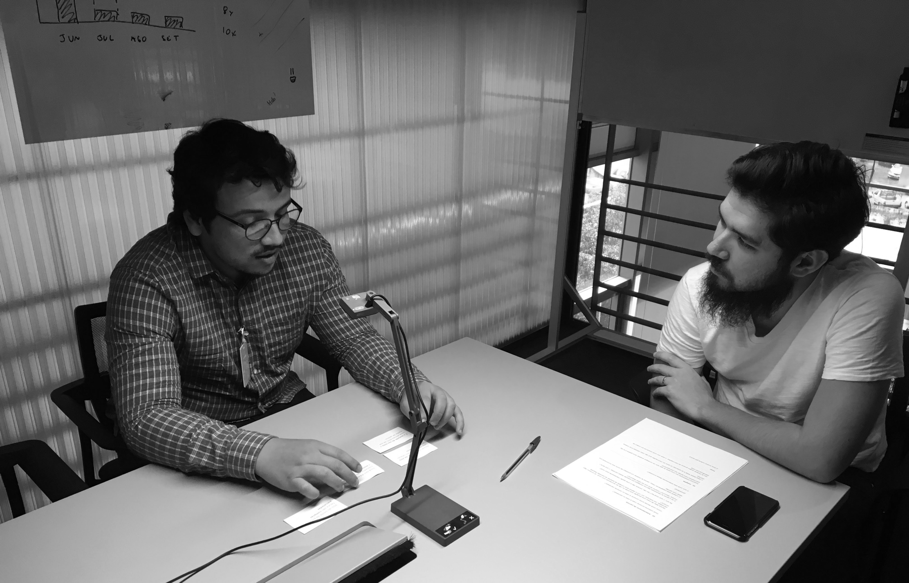
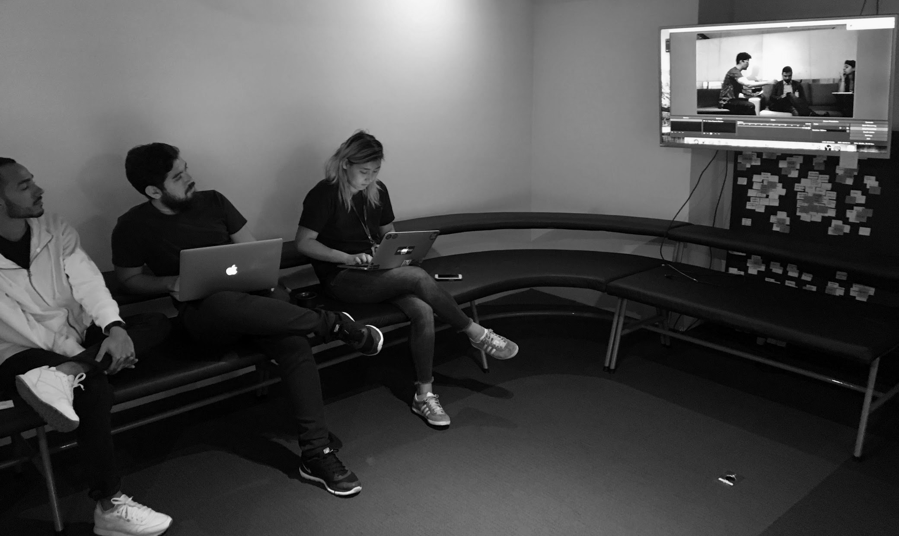
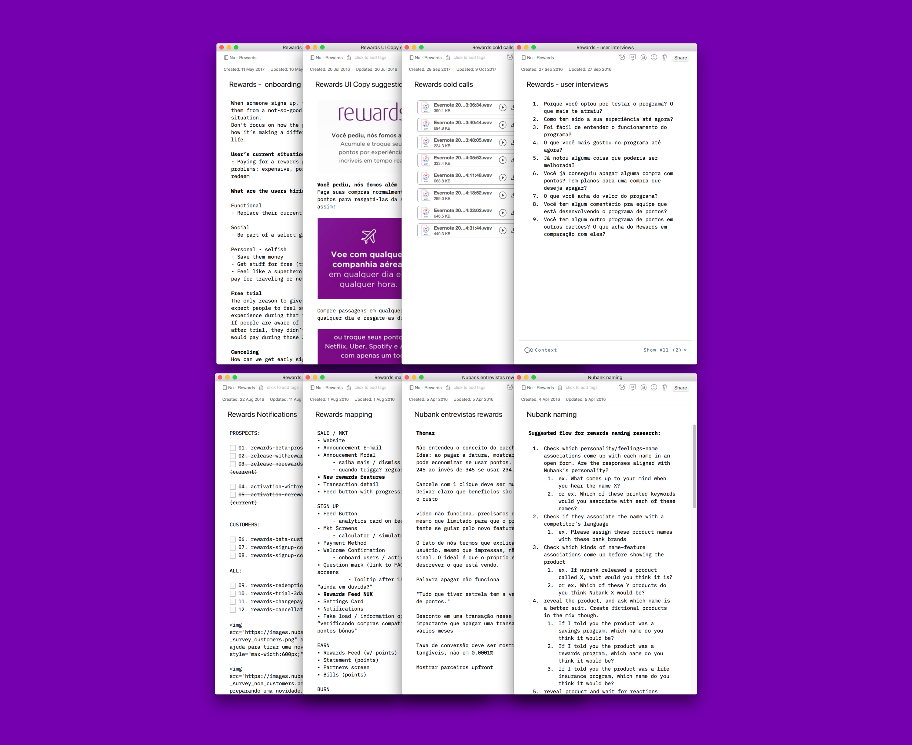
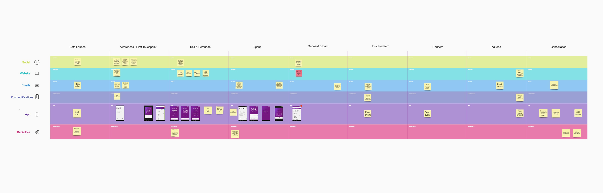
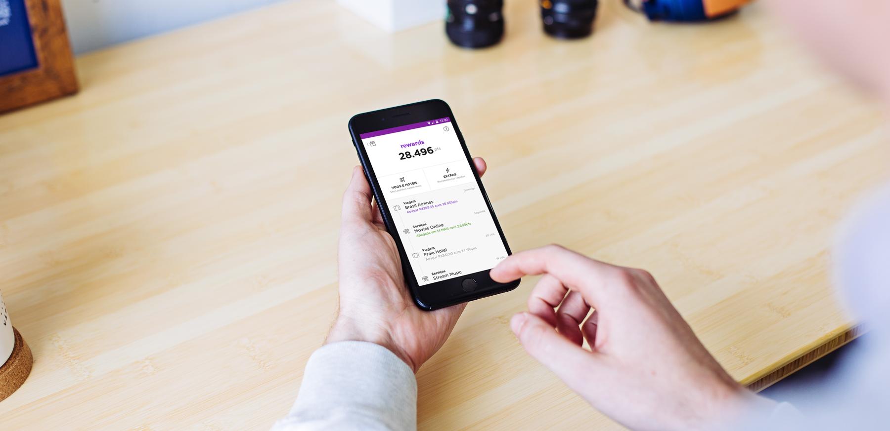
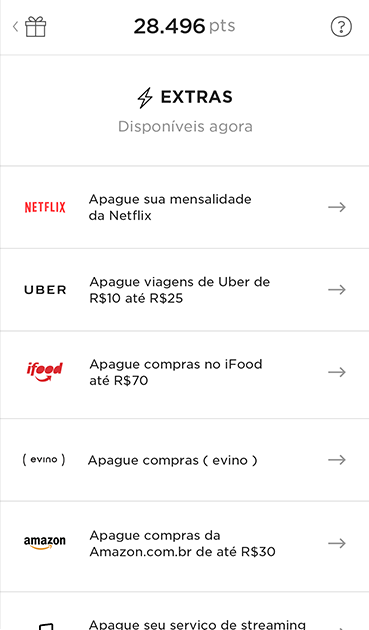
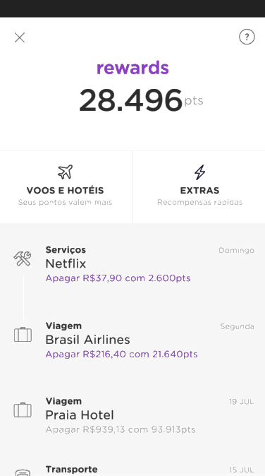

Nubank's rewards program was already scheduled for launch when I joined the company, and my role in it was to put it under a heavy user-testing agenda to find any rough edges we should address before launch day.

After bringing real beta users to the lab, we found significant issues with the understanding of the program that we then addressed by iterating on screens and other touchpoints. Most of the issues found were about copywriting and metal-modeling, which is a natural problem for breakthrough products that are not based on current models. Nubank Rewards is extremely different from what most users are familiar with in this market, so getting them to see the real value of the program's mechanics was a huge challenge to the team.

User testing was not a glamorous part of the Rewards project. It involved a lot of cross-function communication and research gymnastics to help stakeholders build empathy with the early users of the program, feel the existing pains of the to-be-launched experience, and invest in the necessary changes.

At this time, we started experimenting with live-streaming of the tests, so stakeholders could watch the users as they tried to make sense of the product. Changing from reports to live streaming had a huge impact on the speed of our process and on the impact of our insights.

There was little screen design involved in this project. To me, most of the effort was around written docs and presentations, which I used to document and make sense of pain-points, while at the same time exploring alternatives for the next-day tests.

To follow-up with the team with recommendations, I developed a unified UX map encompassing all touch-points for the first user experience. Together, we could now discuss the copywriting on each step of the flow, and compose the message with a broader view of the experience. We designed timely emails, push notifications, and empty-states to help onboard users and get them to the successful, desired state: a proud member of our loyalty program and credit card.

## Results

Helping users understand and experience the value of our Rewards program was one of the hardest challenges I've worked on. There were a lot of expectations involved, both from our customers and stakeholders.

At the end of this process, not only did we launch a product with a smoother onboarding, but we also helped build a stronger trust in which at the time was an incipient UX research practice at the company. Since then, user testing products during the whole design process has become a much more frequent practice at Nubank.

