NuConta is an unprecedented mix of current, savings, and payments accounts, all-in-one. Thanks to a one-year-long co-creative process, our team was able to design and ship a product that uniquely addresses customer needs, becoming [the most downloaded neo-banking app in the world](https://qz.com/1738245/nubanks-app-has-more-downloads-than-revolut-monzo-and-n26-combined/).

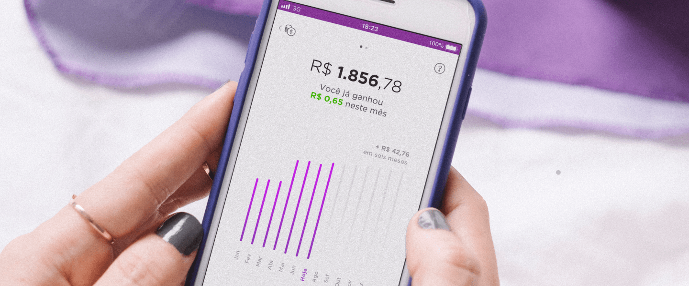

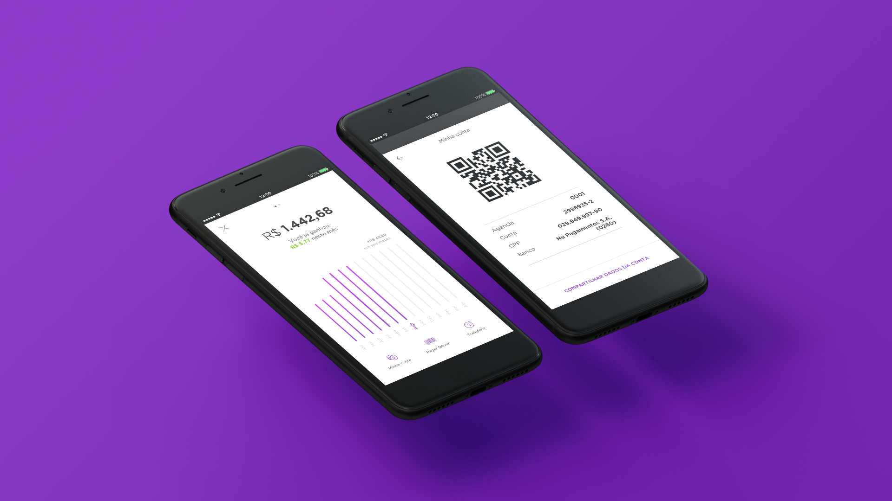

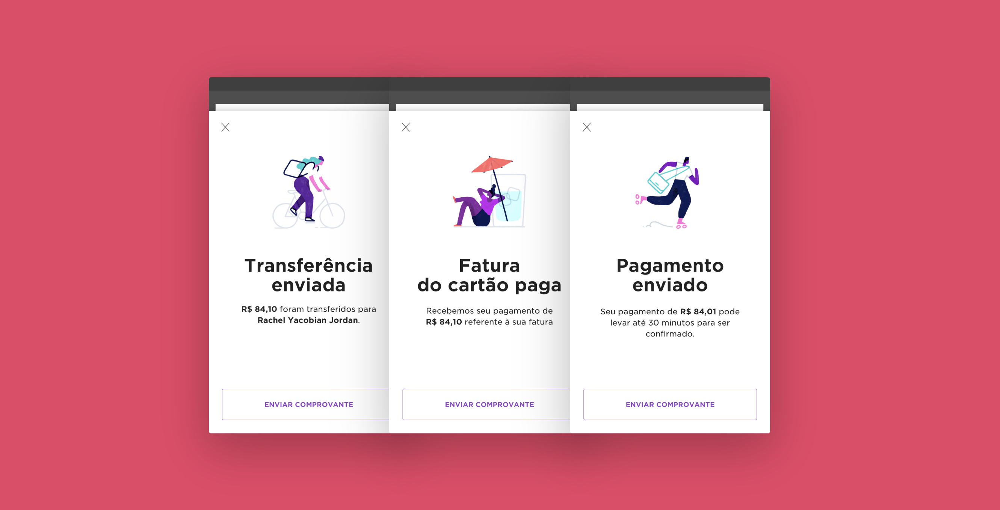

## Problem discovery

We were committed to challenging our most basic assumptions about how people understand and use banking services, so our initial conversations were purposefully broad and naive. We started with a simple list of questions, but we frequently adjusted along the way.

We ran in-depth interviews with people from different ages and backgrounds in the office, but also on public places like malls and a public university. We sat down and very informally let people talk about their financial lives, how they felt about saving, investing, transferring, and spending their money. We also experimented with some visual aids such as card-sorting and very cheap prototypes, but honestly, our best feedback tools were our competitor's websites and products. We learned an incredible amount just by having people experiment with things other companies have already built.

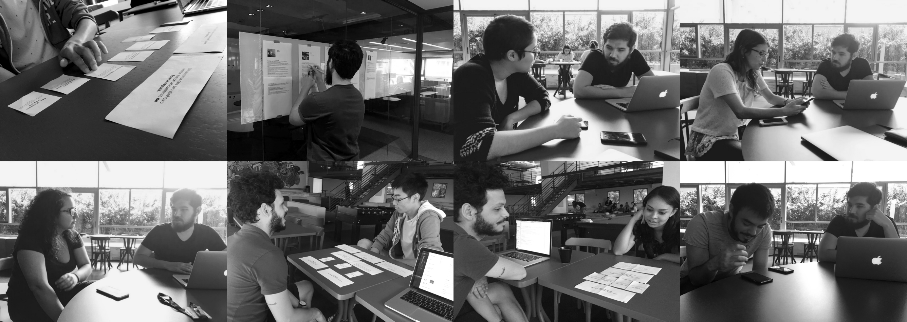

## Problem definition

By combining the data from these interviews with others conducted in our lab, and also talking to a lot of our employees about their finances, we were able to come up with eight personas that represent a gradient of behavior and demographic patterns.

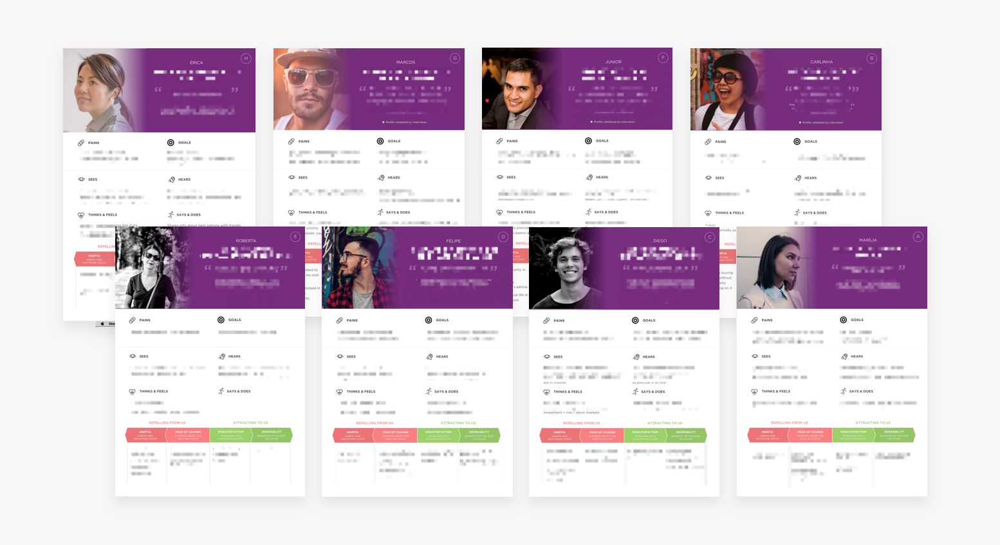

With well-defined personas, we now had a lens through which we could look at the problem. Our initial mission, which was very broad, could now be better expressed in sentences that the whole team could agree on:

> How might we design an evolution of the current and savings accounts, for people looking for a more accessible and easy-to-use bank?

We learned from this process that defining a problem is sometimes harder than sitting down to solve it. After dozens of long work days, heated meetings, lots of head-scratching, word-smithing, and sense-making about the material collected during research, the team was finally committed to a unified vision of the product that reflected our customer’s pains and needs instead of our own. We were now ready to deep dive into exploring solutions that would eventually become NuConta.

## Generating solutions

The first thing we do at Nubank once we have a sound problem definition is what we call a co-design session, which helps us come up with more ideas, better questions, surface constraints and strong stakeholder opinions.

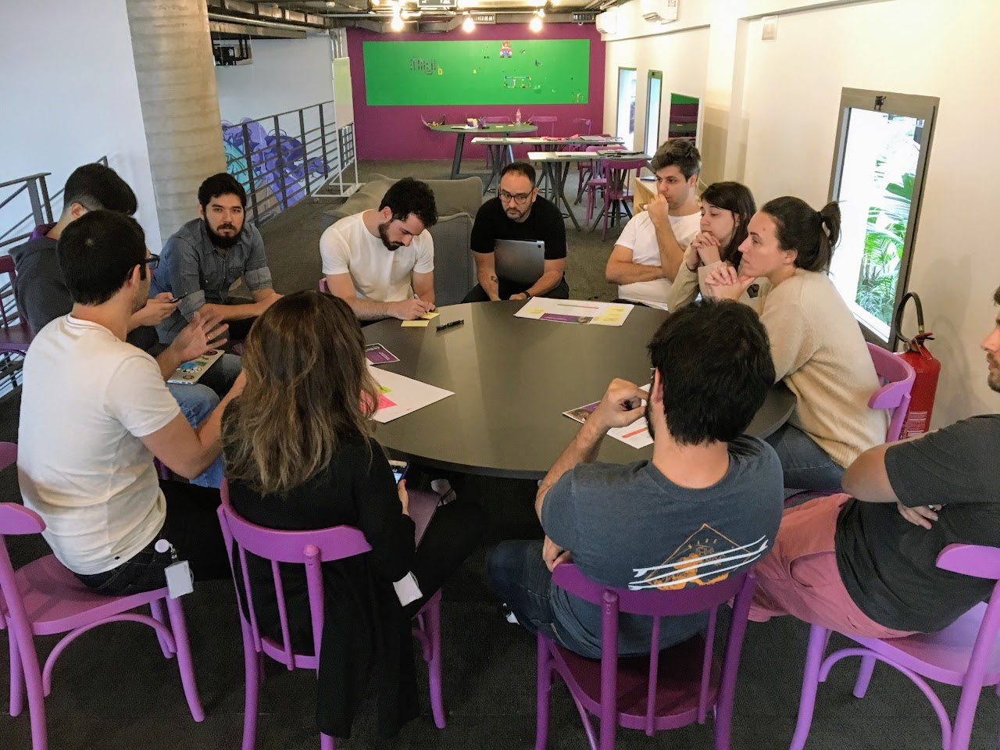
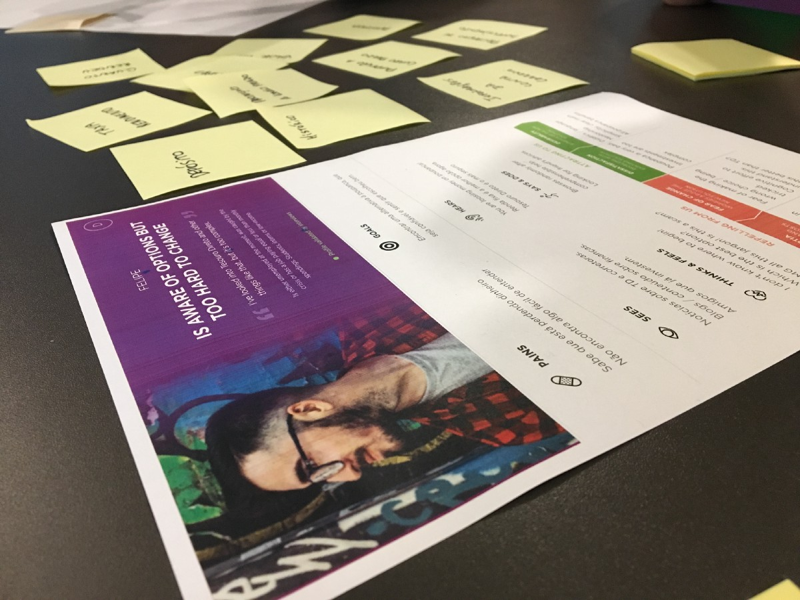
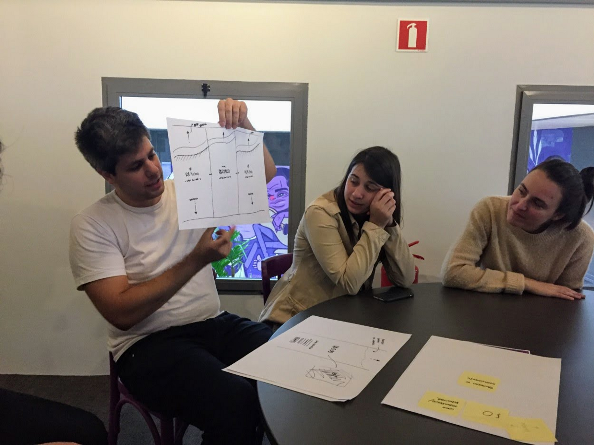

Only after extensive discussion and brainstorming, we felt ready to start wireframes and pixel pushing: we tried dozens of versions of the UI of onboarding flows, empty states, investment simulators, charts (OMG so many charts), financial goals, investment streaks, etc. We allowed ourselves to go quite crazy in the beginning, bypassing many rules of our current design system, and then adjusted as we got closer to the final result.

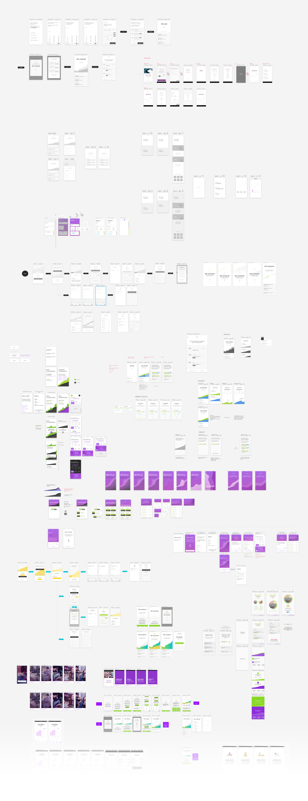

### Prototyping

We made every kind of prototype you could imagine when exploring solutions for NuConta. We made cheap paper prototypes to test copywriting and general information architecture. We made quick Keynote animations to show engineers the vision for a specific interaction. We built screens and flows on Principle to test signup flows and empty states. Some prototypes even had fake branding and visuals so we could go outside the building and show it around in stealth mode.

Starting with simpler, lower fidelity prototypes allowed us to trim the rough edges of the product overall concept, until we eventually hit a level of complexity in the tests that required a more high fidelity, versatile prototype. So we decided to invest in a month-long project to create a full-blown Framer + Javascript prototype that passed variables around, reacted to the user’s financial data, and let them simulate deposits. This was of course not just the work of our design team but a coordinated effort with the technical team to support us not only in programming the prototype but also in user-testing it and iterating on the results.

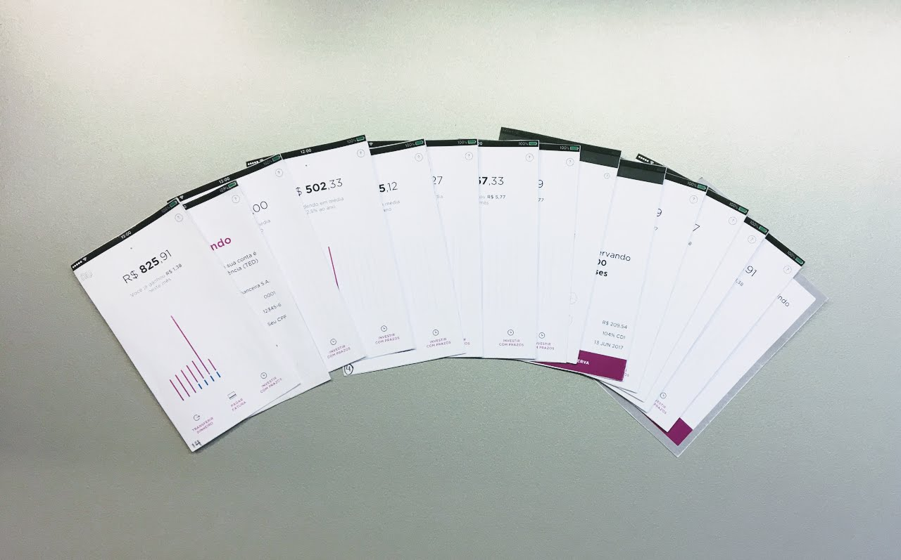

<!-- 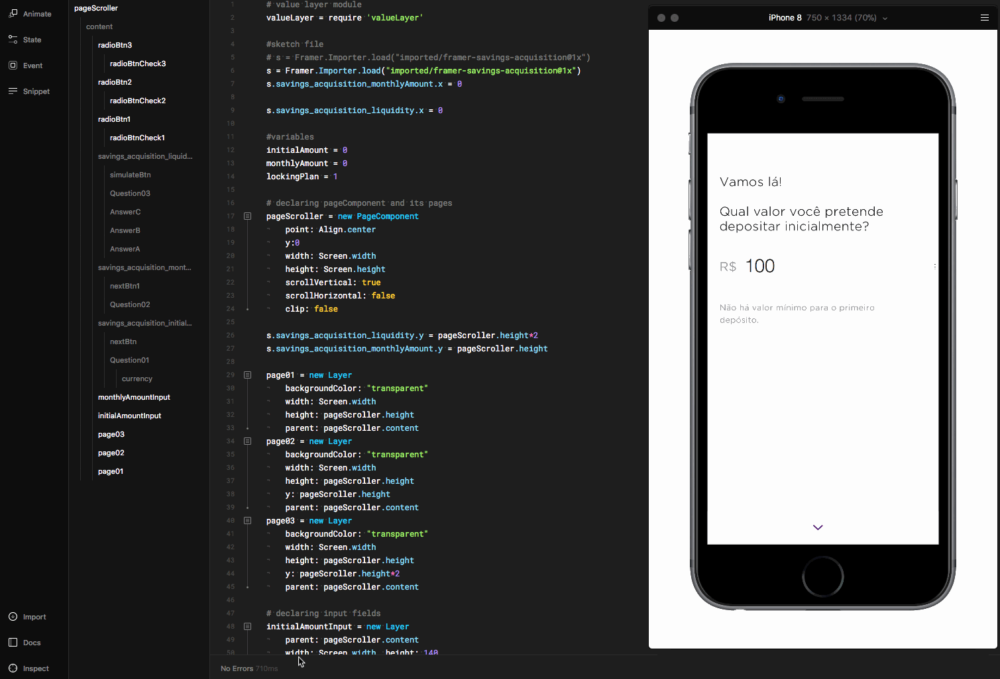 -->

## Delivering the MVP

#### Designing for transparency, with transparency

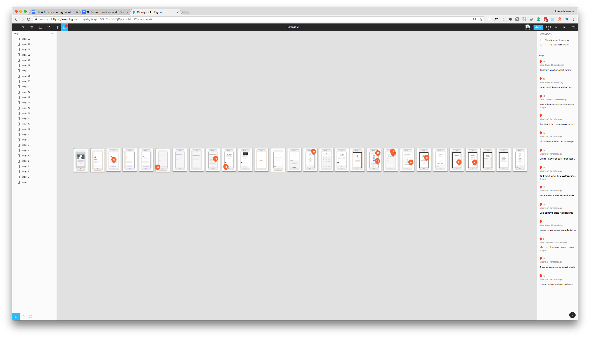

One key component of the speed and quality of our workflow in this project was to use Figma in the early stages of the UI design process, because of the high level of collaboration and transparency it allows. Just like our live streamed user tests, Figma makes it frictionless for stakeholders to watch, participate, and gain empathy for the design process in real time.

#### Mapping the whole experience

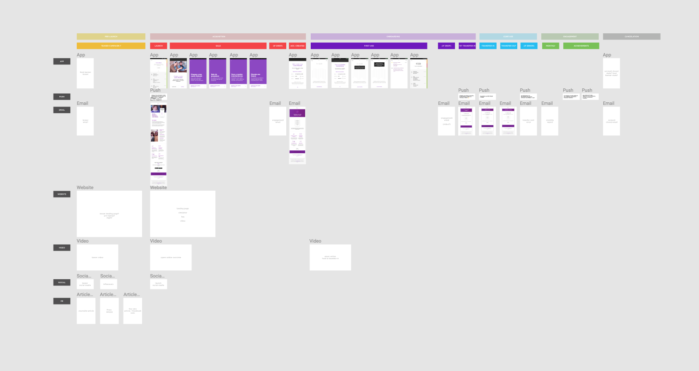

Producing a well-crafted individual screen is satisfying, but we can never forget that every touchpoint is part of a broader ecosystem. Below is an example of how we kept track of every App screen, push notification, email, website page, and social media posts that first-time users would encounter.

> Nuconta makes Nubank the [most downloaded banking app in the world](https://qz.com/1738245/nubanks-app-has-more-downloads-than-revolut-monzo-and-n26-combined/). — Quartz

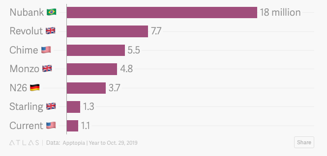

In an October report, Quartz noted that Nubank’s app has been downloaded 18 million times in the past year, more than Revolut, Monzo, and N26 combined. Nubank's monthly active users have risen 200% during that period, second only to Monzo.
