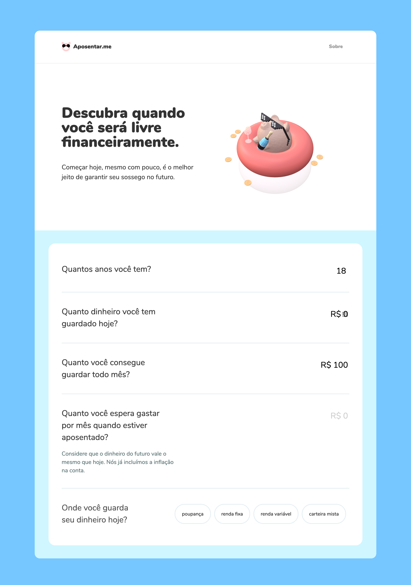
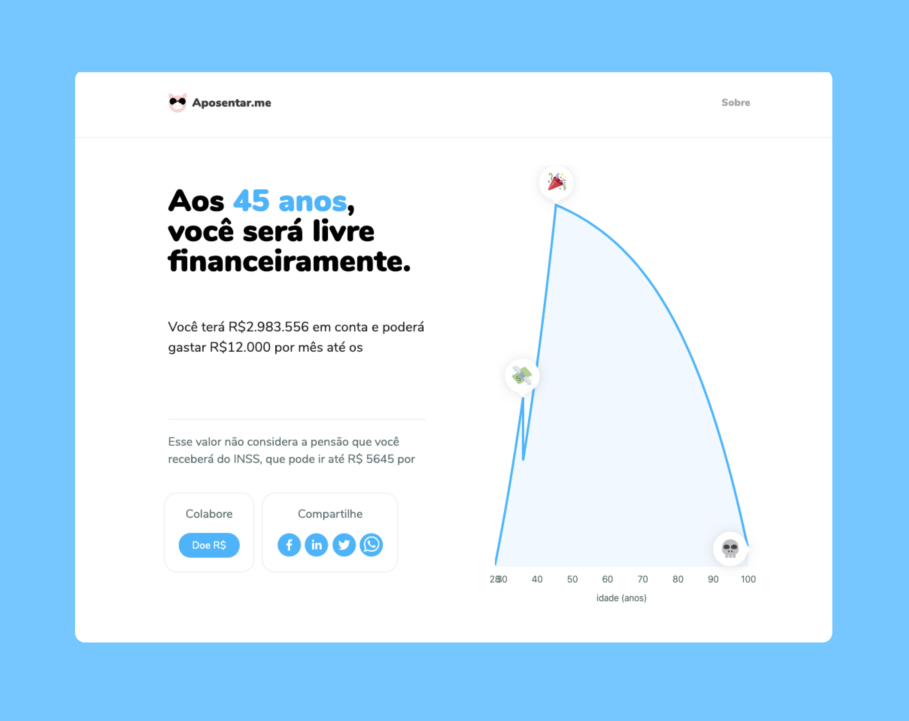

My buddy Guilherme and I were looking around for retirement simulators, and what we found online in Brazil was pretty bad. Calculators out there use too much jargon, or are simply financial tables that are not thought from the point of view of a person who is new to investing. So se wet out to design our own:

> How might we empower newbie investors to understand and play with the variables that impact their future, so they can adjust their plans and have a successful financial journey?

## Requirements

1. Aimed at people who are new to investing, not experts.
2. Ask questions in simple, human terms. No jargon.
3. Give contextual help about people's situation.
4. Be approachable, self-conscious and optimistic.
5. Help us learn React and have fun.

<figure>

</figure>
<figcaption>Embedded the form with personalized educational content</figcaption>

Go see the project [live now](http://aposentar.me), or become a contributor on [Github](https://github.com/lucasnantonio/ff)
