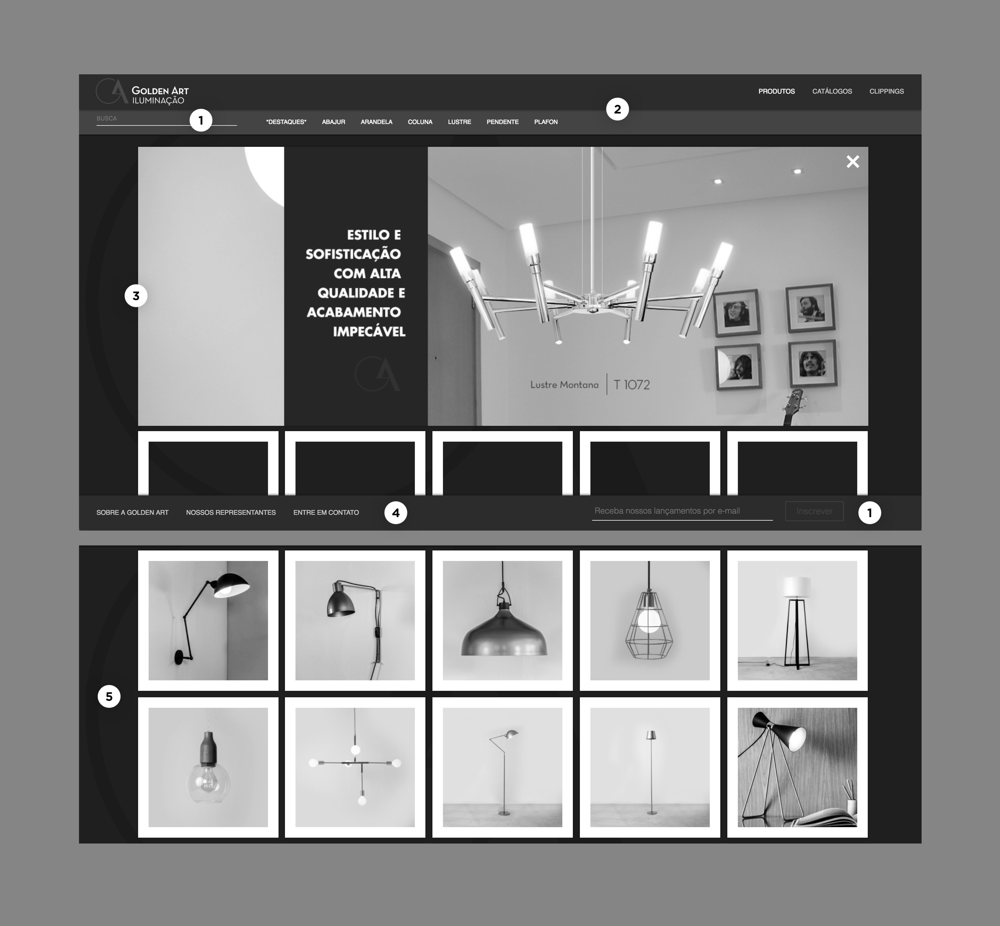
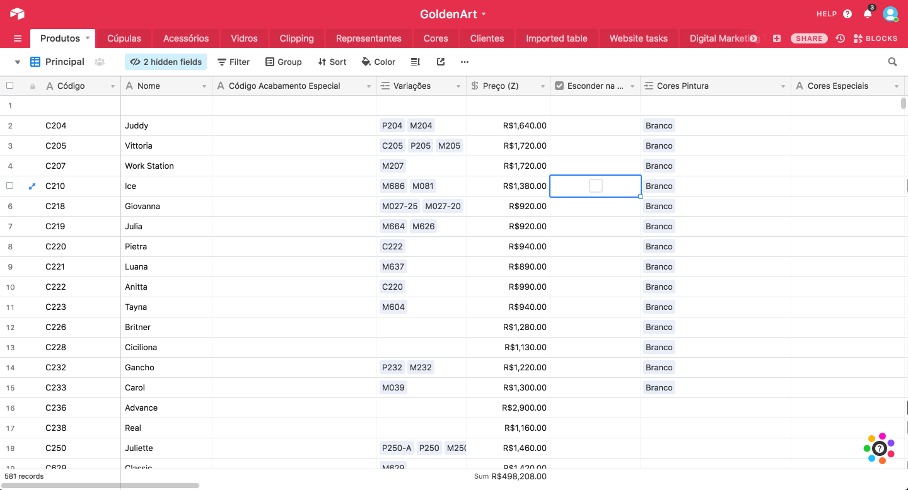

This project is a very simple catalog, but I'm proud of it because it's the first full-stack website I've built and shipped while learning to code. It uses Airtable as the CMS, where the client can update the products' information and actually became the source of truth for the company's inventory. It was a steep learning curve and got me a decent understanding of Javascript, Node, and Express.

  <video class="w-100 mw7 br2" autoplay loop muted>
  <source src="../../images/golden-art/golden-art-scroll-2.mp4" type="video/mp4">
  </video>

  <video class="w-100 mw7 br2" autoplay loop muted>
  <source src="../../images/golden-art/golden-art-scroll.mp4" type="video/mp4">
  </video>

  <video class="w-100 mw7 br2" autoplay loop muted>
  <source src="../../images/golden-art/golden-art-filters.mp4" type="video/mp4">
  </video>

One of the customer's biggest problems was picking a color finish from the catalogue. To this date, the company did not have a way to accurately represent all the colors available. We tried scanning and photographing the materials, but the best results came from 3D renderings. I had fun experimenting with Vectary, a browser-based 3D tool, to produce the images below:

  <video class="w-100 mw7 br2" loop muted autoplay>
  <source src="../../images/golden-art/golden-art-colors.mp4" type="video/mp4">
  </video>

## Problems with the old version

The client and I walked through the old website together and listed the main issues that needed a fix. Visually, they felt like the website was too dark, and that functionally it was clunky, had many bugs, and was hard to maintain and update. The product pages opened in a lightbox, which made it difficult for users to save and share specific pages. Also, the website was not responsive, which increased a high mobile bounce rate.

1. We found various legibility problems with the colors used in some fields.
2. Submenus and links were added with time on top of the original structure, which created a very questionable information architecture.
3. The main banner was a static image with flattened text, which was hard to update and read on mobile.
4. The bottom menu was fixed, which occupied too much real estate.
5. The client had little control over the order in which the products were displayed.

## CMS architecture and backend

GoldenArt has over 500 products in their catalog. The old Wordpress website was painful because it required the company to keep the CMS up-to-date with their in-house catalog system, which was an Excel spreadsheet. In researching solutions to this problem, I found Airtable, and the client and I fell in love with it.

<figure>

</figure>
<figcaption>The product database, built on Airtable</figcaption>

It is a very friendly platform, and it became the internal source of truth for all the information about the product lines, which gets shared with their partners and clients. As they change the info on Airtable, the website is updated in real-time.

## Results

The new website has a much more coherent structure, with products divided by line and type. This makes it easier for a user, such as an architect, to find the kind of product they're looking for. It's easier for the client to add and change details about each product, attach technical drawings and 3D files, and now each product has a dedicated shareable page.

To me, this was a challenging and fulfilling side project that quickly elevated my knowledge of web design and development. After working long hours to ship the website and after the multiple times I accidentally took it down, I'm now much more comfortable having technical discussions with folks in the product teams at work.
