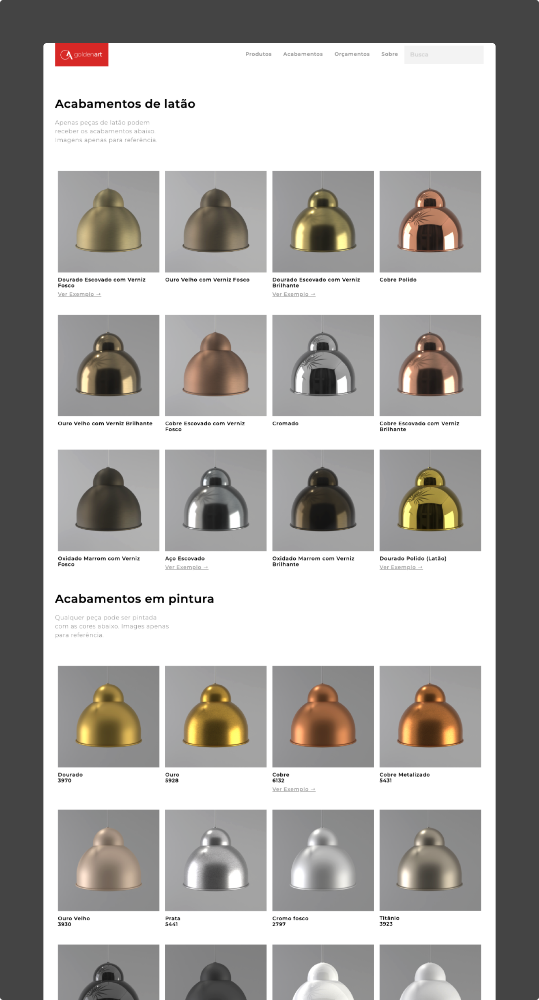

This project is a very simple catalog, but I'm proud of it because it's the first full-stack website I've built and shipped while learning to code. It uses Airtable as the CMS, where the client can update the products' information and actually became the source of truth for the company's inventory. It was a steep learning curve and got me a decent understanding of Javascript, Node, and Express.

## Backend

GoldenArt has over 500 products in their catalog. The old Wordpress website was painful because it required the company to keep the CMS up-to-date with their in-house catalog system, which was an Excel spreadsheet. In researching solutions to this problem, I found Airtable, and the client and I fell in love with it.

It is a very friendly platform, and it became the internal source of truth for all the information about the product lines, which gets shared with their partners and clients. As they change the info on Airtable, the website is updated in real-time.

</img>

## Results

The new website has a much more coherent structure, with products divided by line and type. This makes it easier for a user, such as an architect, to find the kind of product they're looking for. It's easier for the client to add and change details about each product, attach technical drawings and 3D files, and now each product has dedicated shareable page.

To me, this was a challenging and fulfilling side project that quickly elevated my knowledge of web design and development. After working long hours to ship the website and after the multiple times I accidentally took it down, I'm now much more comfortable having technical discussions with folks in the product teams at work.
