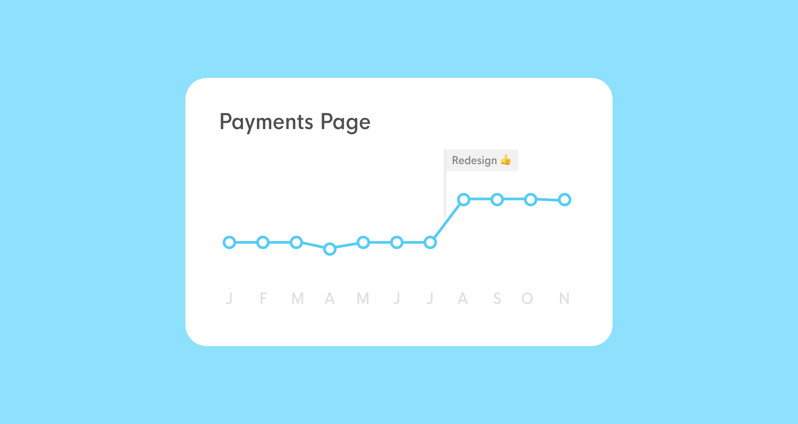

Receiving suggestions, feature requests, complaints, and bug reports from users, like any other type of customer-focused evidence, is essential fuel for high-performing technology teams. 

NPS and satisfaction surveys, App Store Reviews, and customer support logs are all important sources of evidence for product decisions, but tend to be too generic, noisy, hard to categorize and measure, making it difficult for teams to focus on the right things and objectively measure the impact of product changes.

How can we optimize the feedback channels so that we get measurable, contextual, precise, actionable information?

<!-- 

The first problem is overloading the customer support team with product feedback and feature requests. At Petal, we work very closely with our Operations team to understand the input they get by interacting with users, but we like to think that their time and expertise is much better spent helping people in need than categorizing desired features.

The second problem is getting feedback that is too generic to be actionable. Here, NPS surveys and App Store reviews are king.
While important for other purposes, they both suffer from the same gap: feedback here tends to be framed as "satisfaction with my experience in general", and thus less likely to be immediately insightful. Additionally, when submitting this type of review, customers are taken _away_ from the experience of the product, and having to lean on their memory to describe their troubles and suggestions.

Last, there's the problem of categorizing and quantifying. User-submitted messages that come via support, App Stores, or NPS are hard to group, parse, and measure. When reading feedback messages come in, it's easy to overreact to a sequence about a topic that is hot today, while ignoring another that has been coming consistently twice a day, for months. -->

## Requirements

Observing the challenges above, our requirements for our feedback tool were:

1. __Measurable__ We want to output a number that tells us if feature A causes more dissatisfaction than feature B.
2. __Specific and actionable__ We want the ability to learn about specific moments in the user's journey, specific pages in the app, and features we launch.
3. __Contextual__ We want people to give feedback _in the moment_ they're interacting with something, not recalling it days or weeks after.
4. __Passive__ We don't want feedback prompts to interrupt the action someone is trying to perform.

## The design

So here's what we've built: a reusable feedback module that we can add to any page or flow in our app. By clicking it, users are able to provide immediate feedback about what they're trying to do and how they think we could improve it. First, users are prompted to submit a 5-scale score, followed by a text field to explain why.

  <video class="w-100 mw5 br2" autoplay loop muted>
  <source src="../../images/petal/feedback-flow-3.mp4" type="video/mp4">
  </video>

## Results

First of all, we can now look objectively at how our pages and features are being evaluated by our users, and prioritize which ones need more work:

Also, because the call to action is more contextual than an after-the-fact survey, individual messages become much, much more specific and actionable:

By looking at and communicating the impact of design objectively, it becomes easier to earn a "seat at the table", since these measurements can bubble up to company objectives.

