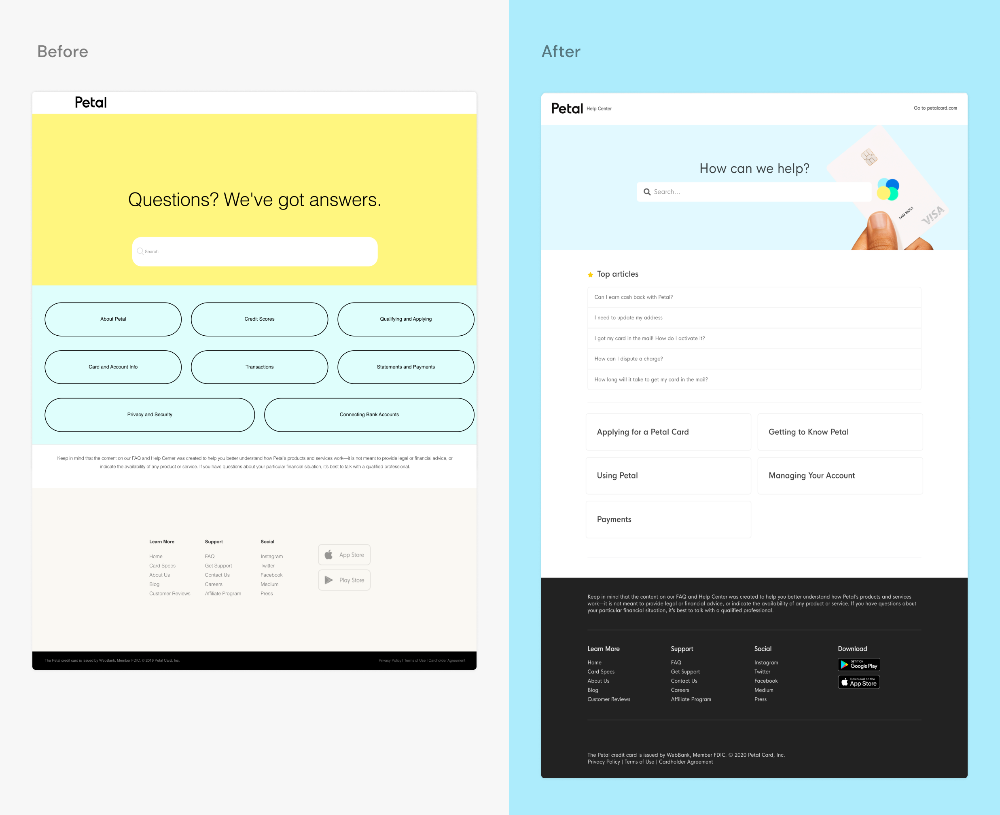
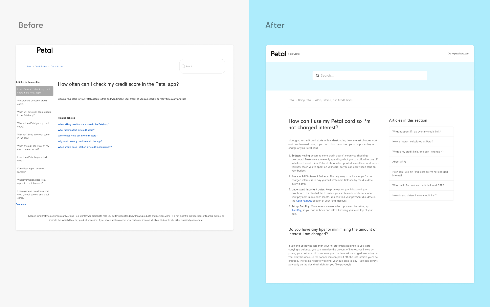
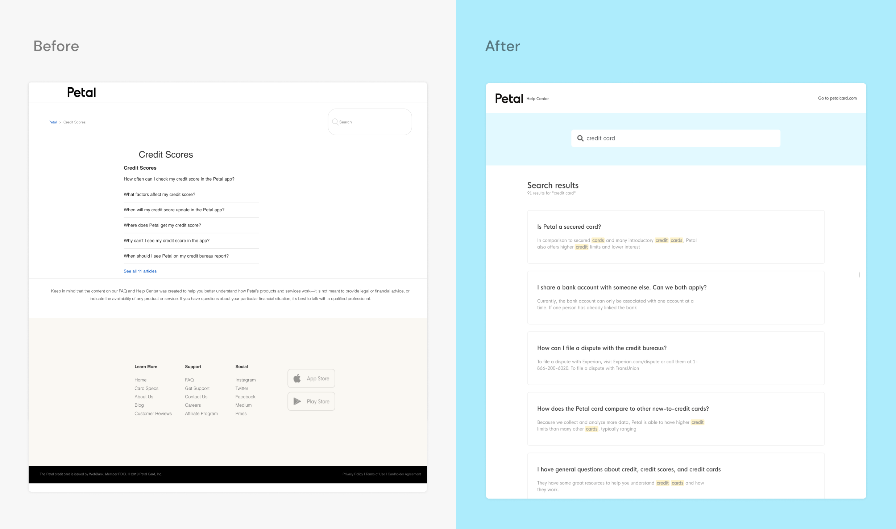

When I joined Petal, they hadn't had the time to give some design love to one of their most common touchpoints with the customer: the help center.

In an early-stage, lean product team, this kind of initiative can be hard to prioritize since results are hard to measure and other projects might seem more important. Instead of designing a new layout that an engineer would have to decypher and code, I decided to be scrappy, jump in, and customize the template myself.

Learning Zendesk Developer tools was very instructive, and in addition to refreshing the design we enabled various features that will make our customers better able to self-serve.

