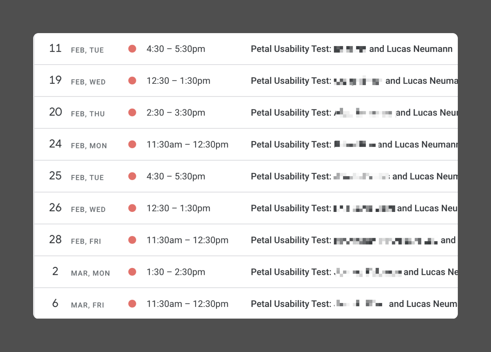

Most teams know that talking to users frequently is a key habit to increase empathy, de-risk projects, find innovation opportunities. At Petal, where "listen with curiosity" and "our job is never done" are company values, this is no different.

In practice, though, scheduling and executing user interviews is messy, time-consuming and can feel like a burden for teams that are used to moving fast. Querying the base, emailing back-and-forth to find the best time, screening, and signing NDA docs with multiple candidates at the same time can easily eat away a good chunk of someone's calendar.

When kicking off Petal's research program, it has been our goal from the start to unblock user interviews by getting rid of the recruiting overhead and make it "just happen". I partnered with Jack Docal, my marketing colleague and automation wizard, to find a better way.

Instead of designing a specific research study or topic, for this project our philosophy was "let's get the users coming, and no matter what we show them, we'll learn something every week"

## The workflow

1. NPS survey
2. Opt-in
3. Screener questions
4. NDA and Agreement signing
5. Scheduling a time

The automated workflow uses a mix of tools: Iterate, Zapier, Segment, Google Sheets, and Calendly.

Everything starts on our NPS survey, sent to members after they've been using the card for a while. On this survey, there's an opt-in question that asks them if they'd be interested in joining a research session.

If they say yes, they're taken to a quick screener designed to filter out technical people folks. If they pass the screener, they receive an email with a link to sign NDA documents, and from there are taken to Calendly, where they can find the time that best suits them.

A Zoom call is created, and they get a last confirmation email with instructions on how to get prepared for the call.

## Results

When we turned the workflow on, we got 10 users scheduled in a week's time, and that's with a low sample of NPS surveys sent. Getting this same number with a hands-on recruiting outreach would have taken much longer, and now we have the ability turn it on or off depending on the demand.

## Next Steps

This automated flow, of course, does not cover all the user research bases. It's biased towards people who have already been using the card; towards people who are comfortable going through our many partners' tools; and does not help us conduct studies with people in a specific state or journey.

We're working on many other initiatives to ensure our teams have the best evidence they can to make user-centered decisions: automated surveys, contextual feedback entry-points in-app, A/B testing frameworks, data democratization, and our internal empathy gauge. Keep tuned to hear more about them all.
