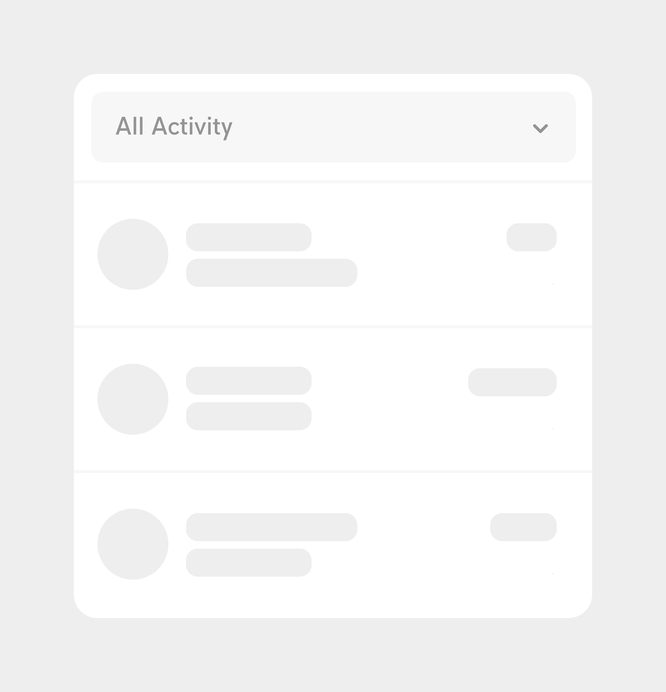
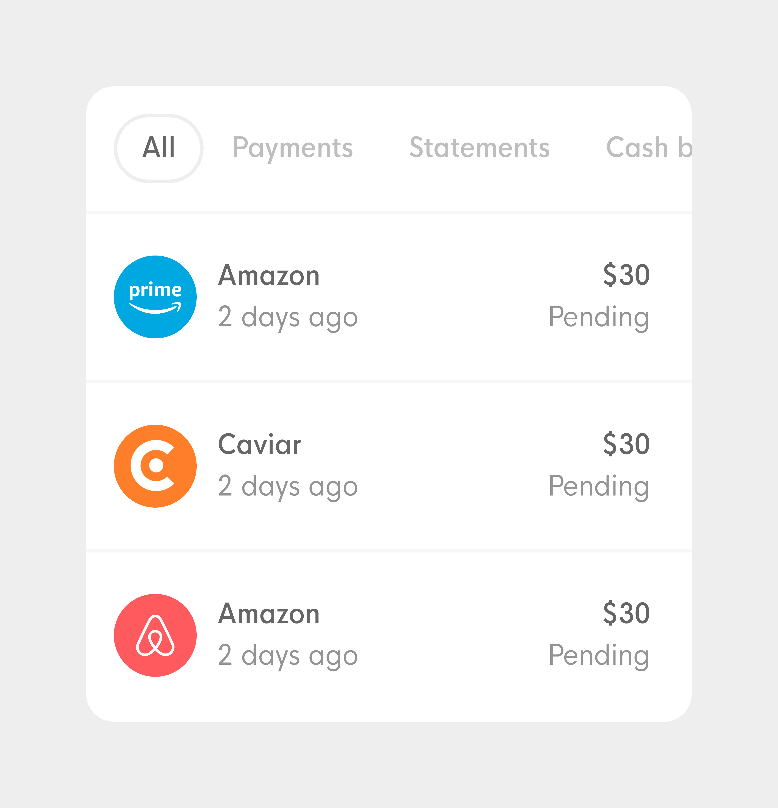
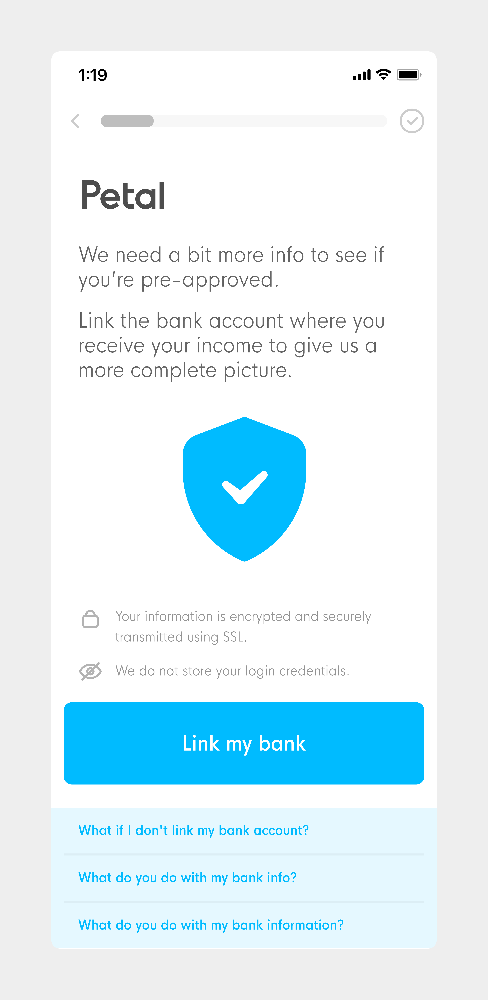
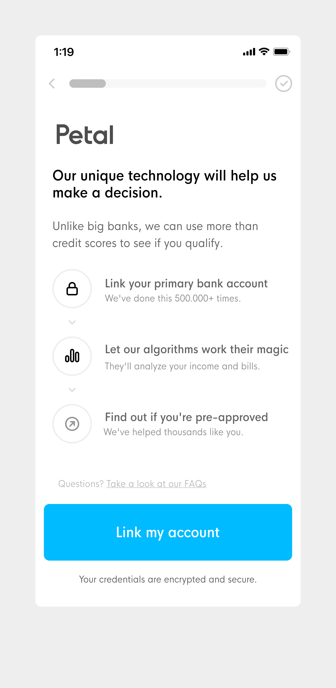

|  |  | 
|--------- | --------|
| __Before 🤔__        |__After ✨__         |
| Users reported problems finding their stuff | 20% increased engagement with filters mentioned by users. | 

|  |  | 
|--------- | --------|
| __Before 🤔__        |__After ✨__         |
| Users reported problems finding their stuff | 20% increased engagement with filters mentioned by users. | 

|  |  | 
|--------- | --------|
| __App cleanup__|
| __Before 🤔__        |__After ✨__         |
| Users reported problems finding their stuff | 20% increased engagement with filters mentioned by users. | 

<!-- 

__Before__Users reported difficulty finding their statements and payments

__After__20% higher clicks on statements and payments

 -->