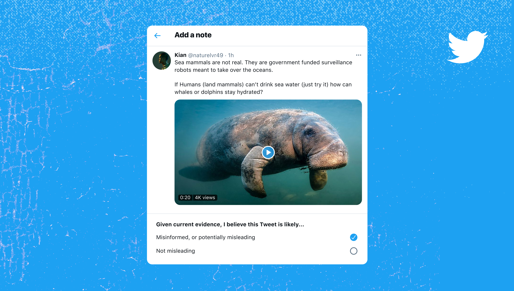
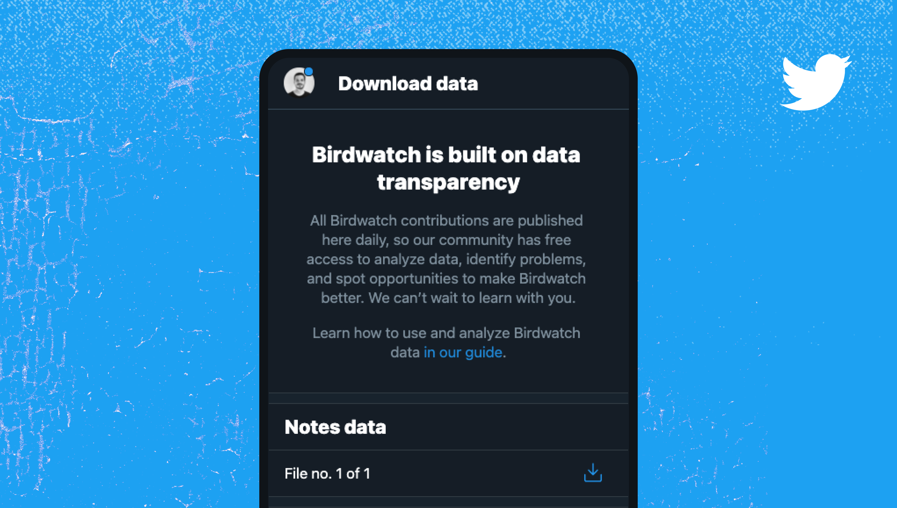
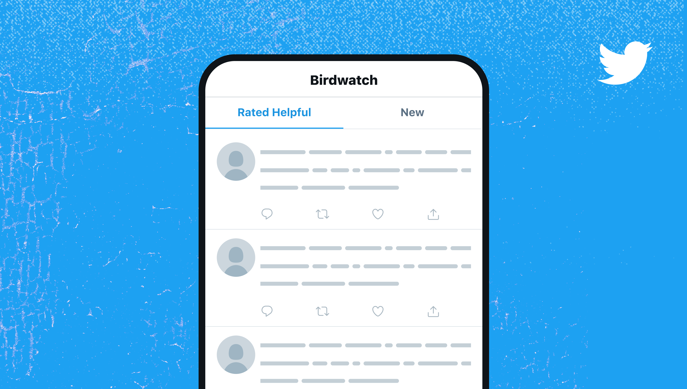
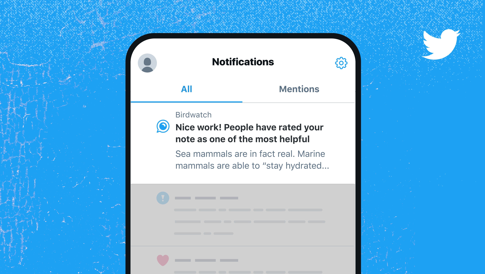
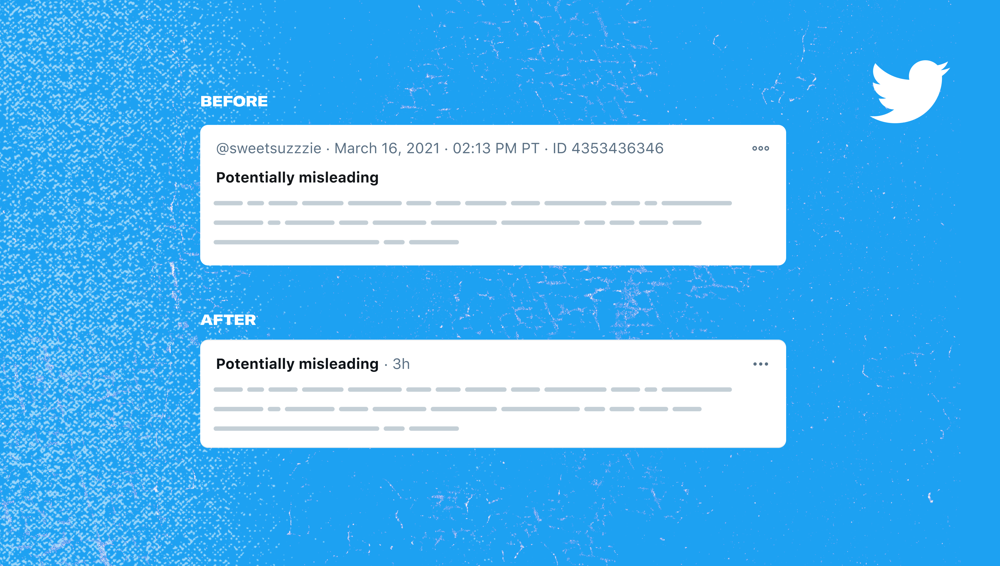
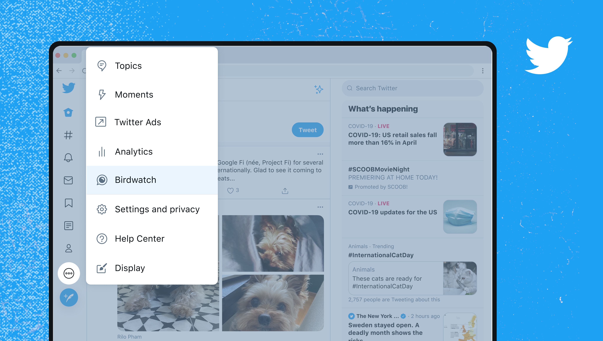
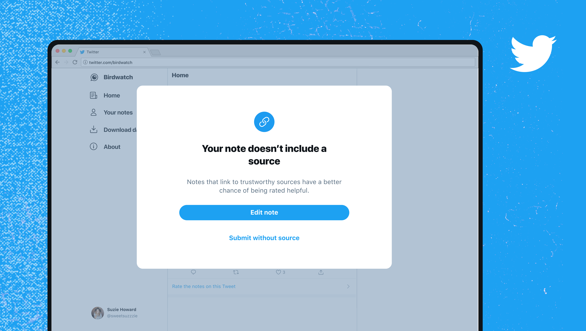
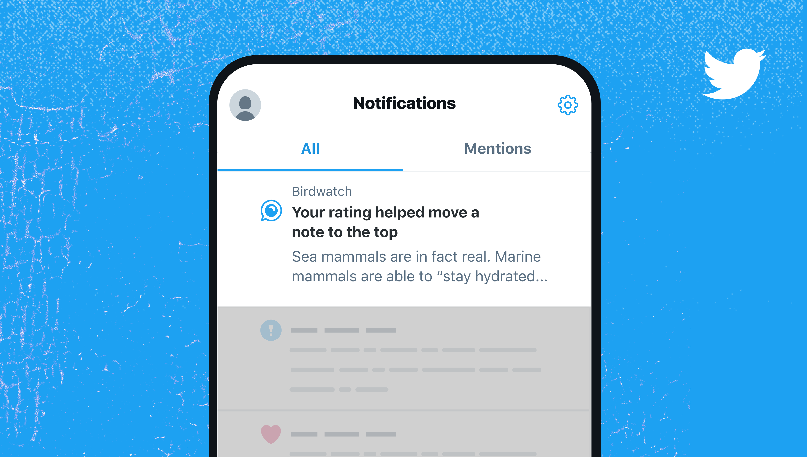
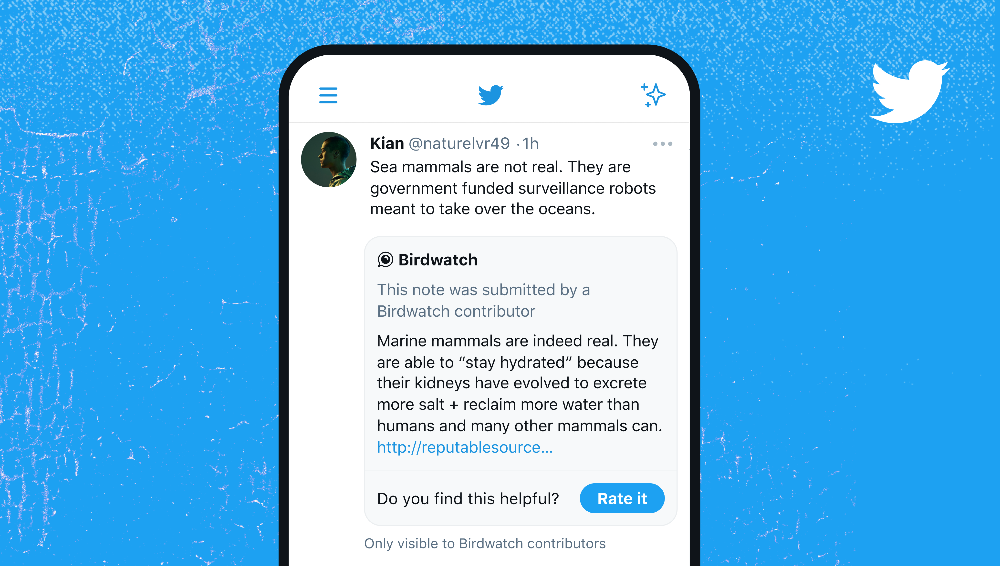

 

# Introduction

People come to Twitter to stay informed, and they want credible information to help them do so. This isn’t always easy with the spread of misleading information online. Birdwatch is a community-driven approach to addressing this problem, seeking to create a better-informed world.

# Project journal

Currently, Birdwatch is in pilot mode for people in the US. We’re building it in the open, with the public’s input, and we’re taking significant steps to make Birdwatch transparent. In the spirit of building in public, I decided to keep a journal of learnings, launches and changes.

# October 21 2020

I joined the team!

The product was in shaping stage. My main goals during this time were to work with our researcher to identify main pain points with our prototype and prepare the product for launch date, while working with our product lead to define the roadmap post-launch.

# Jan 25 2021

Our pilot program [launched](https://twitter.com/birdwatch/status/1353774171684106243), allowing a groups of people to add notes to Tweets they think could be misleading, and rate the quality of each others' notes.

# Feb 01 2021

Released our first Birdwatch dataset. We publish data daily so that anyone — experts, academics, reporters, hobbyists — has free access to audit, identify problems, and spot opportunities to make Birdwatch better.

# Feb 17 2021

Introduced two different tabs in our main page with the goal of elevating helpful content.

# Mar 01 2021

Introduced our first notification in order to provide incentives and reminders to contributors

# Mar 19 2021

From a first-principles decision that quality of content on Birdwatch should be more important than who wrote it, we hid author's name from the note component. This change also helps keep our contributors safe.

# Apr 02 2021

Birdwatch becomes a first-class citizen on the Twitter menu, giving contributors a more convenient way to access the platform.

# Apr 15 2021

Introduced simple nudges that guide people to writing more helpful notes. For example, reminding them to add sources or explain why they think a Tweet is misleading.

# Apr 29 2021

Introduced notifications to reward helpful raters, as well as writers.

# Jun 2 2021

Birdwatch notes started appearing on Twitter, for pilot participants only. It's a big milestone because it means contributors can get a better sense of the "whole cycle" of their contributions and impact.

  <video class="w-100 br2" autoplay loop muted>
  <source src="../../images/twitter/birdwatch-guide.mp4" type="video/mp4">
  </video>

# Jun 14 2021

Launched a reputation system that ranks contributors according to how helpful they are. We also [published](https://twitter.github.io/birdwatch/about/ranking-notes/) the code that powers this system in the open-source community, on a Github Pages Hugo website I built and help maintain.

# Stay tuned for more!

<a href="https://twitter.com/birdwatch" target="_blank" class="bg-white ba link pa3 ph4 br-pill fw6 bg-hover-near-white" style="">Follow us @Birdwatch</a>
